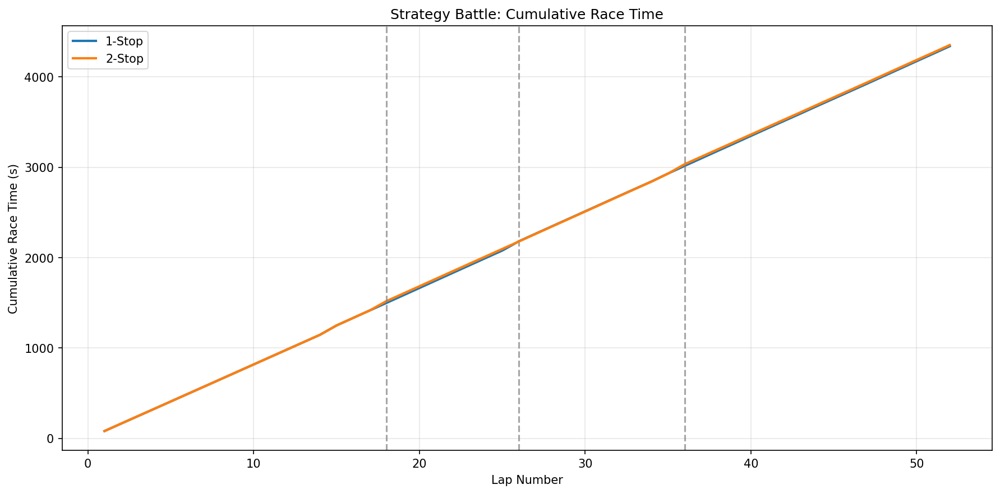
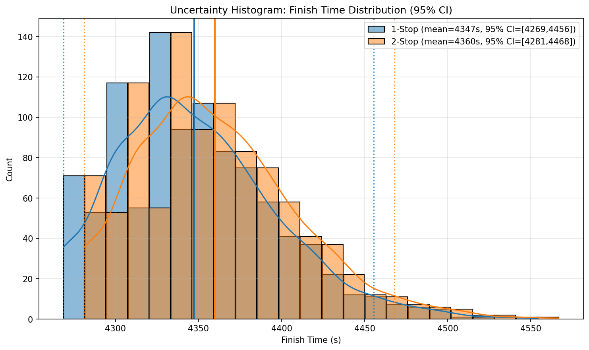
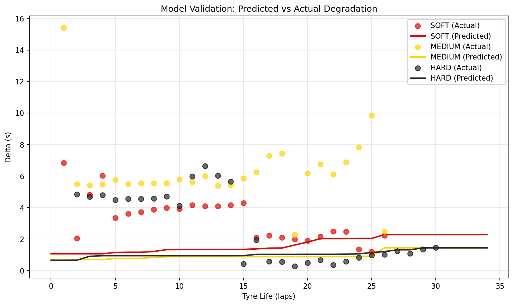
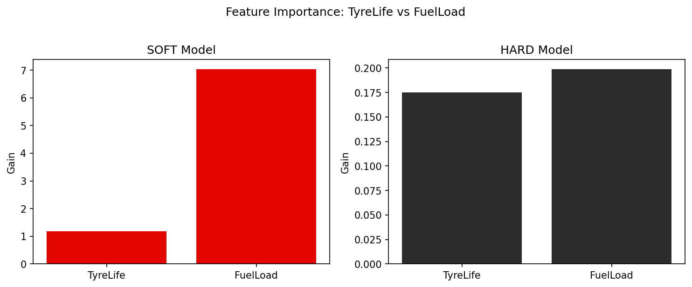

# GrandPrixAI

An F1 race strategy simulator using Monte Carlo simulation and XGBoost lap-time prediction. Compares pit-stop strategies (1-Stop vs 2-Stop) under stochastic Safety Car events.

## Project Overview

GrandPrixAI simulates Formula 1 races lap-by-lap to evaluate strategy trade-offs:

- **Data**: FastF1 telemetry (British GP + Spanish GP 2024, top 5 finishers)
- **Model**: Compound-specific XGBoost regressors predicting lap-time degradation (Delta)
- **Simulation**: Monte Carlo with 5% Safety Car probability per lap
- **Output**: Strategy Battle plot, Uncertainty Histogram, Model Validation, Feature Importance

## Technical Highlights

### Multicollinearity Analysis

EDA revealed that `FuelLoad = TOTAL_LAPS - LapNumber` creates a perfect negative correlation. Using both would drown out the tire degradation signal. The pipeline uses **FuelLoad only** as the weight proxy.

### Regime-Based (Compound-Specific) Modeling

Instead of one model for all compounds, we train **three separate XGBoost models** (SOFT, MEDIUM, HARD). This avoids the "averaging problem" where high-variance MEDIUM data would pull SOFT and HARD predictions toward a global mean.

### Monotonic Constraints

XGBoost is configured with `monotone_constraints` so that:
- **TyreLife**: 1 (older tires → same or slower laps)
- **FuelLoad**: 1 (heavier car → slower laps)
- **TyreLife_x_Fuel**: 1 (interaction for heavy-car degradation)

### Feature Engineering

- **TyreLife_x_Fuel**: Interaction term capturing that tire age matters more when the car is heavy
- **Contextual Outlier Filter**: Drops laps >3.5s slower than lap-average (traffic/noise)
- **7% Median Filter**: Removes laps >7% slower than driver median

## Setup

```bash
python3 -m venv .venv
source .venv/bin/activate
pip install -r requirements.txt
```

On macOS, XGBoost may require: `brew install libomp`

## Usage

```bash
source .venv/bin/activate
python main.py
```

Outputs are saved to `results/`.

## Results

### Strategy Battle



Cumulative race time vs lap for 1-Stop (MEDIUM→HARD) and 2-Stop (MEDIUM→MEDIUM→SOFT) strategies. Vertical dashed lines mark pit stops. The 1-Stop strategy finishes marginally faster (~4347s vs ~4360s) because the 20s pit loss incurred twice by the 2-Stop strategy outweighs the pace gain from fresher tires in the final stint. The lines track closely for most of the race, with the 2-Stop gaining ground after each stop before falling behind again.

### Uncertainty Histogram



Simulated finish time distributions (1000 runs) with 95% confidence intervals. Both strategies show similar variance (~48s std), with substantial overlap in their distributions. The 1-Stop mean (~4347s) is ~13s faster than 2-Stop (~4360s), but the overlap indicates that in individual races, a 2-Stop could still win depending on Safety Car timing and stochastic lap-time variation.

### Model Validation



Predicted vs actual degradation (Delta) by tire compound. Scatter points show observed data; solid lines show model predictions. **Analysis:** The predicted curves are flatter and lower than the actual data—the model underestimates degradation across all compounds. This reflects the known limitation: FuelLoad dominates the learned signal, so the model favors fuel-burn effects over compound-specific tire wear. SOFT shows the steepest predicted slope (closest to reality); MEDIUM and HARD predictions remain conservative. Monotonic constraints ensure predicted Delta never decreases with TyreLife.

### Feature Importance



Gain-based importance of TyreLife vs FuelLoad for SOFT and HARD models. **Analysis:** FuelLoad has substantially higher gain than TyreLife in both models—especially for SOFT, where FuelLoad is ~6× more important. This confirms why degradation is underestimated: the model learns the fuel-weight effect (strong, consistent) more readily than tire degradation (weaker, compound-specific). The HARD model shows lower overall gain values, suggesting these features contribute less to HARD lap-time variance, consistent with HARD tires being more durable and less sensitive to age.

## Known Limitations (Technical Discovery)

**Fuel-burn signal dominates tire degradation.** Feature importance analysis shows that `FuelLoad` has substantially higher gain than `TyreLife` in both SOFT and HARD models. As a result:

- Predicted degradation curves are **conservative** (underestimate actual Delta)
- Lap-time predictions favor the fuel effect over compound-specific degradation
- Strategy Battle and Model Validation plots show flatter, lower-than-actual degradation

This is a known limitation of the current feature set and model architecture. The tire cliff (non-linear SOFT degradation) is not fully captured.

## Future Work

- **Physics-Informed Neural Networks (PINNs)**: Explore PINNs to encode tire degradation physics and better model the non-linear "tire cliff" for soft compounds
- **FuelLoad decoupling**: Experiment with removing FuelLoad from degradation models to isolate the tire signal
- **Additional races**: Expand dataset (e.g., Monaco, Monza) for broader compound coverage
- **Pit loss calibration**: Tune `PIT_LOSS_SECONDS` from real-world data

## Project Structure

```
GrandPrixAI/
├── config.py           # Race, strategy, simulation constants
├── main.py             # Orchestration
├── requirements.txt
├── results/            # Generated plots
└── src/
    ├── data_ingestion.py   # FastF1 loading, cleaning, outlier filters
    ├── ml_model.py       # Compound-specific XGBoost, predict_lap_time
    ├── strategy_engine.py # Monte Carlo RaceSimulator
    └── visualization.py   # Strategy Battle, Uncertainty, Validation, Feature Importance
```

## License

MIT
